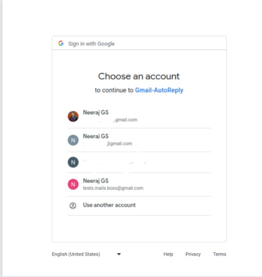
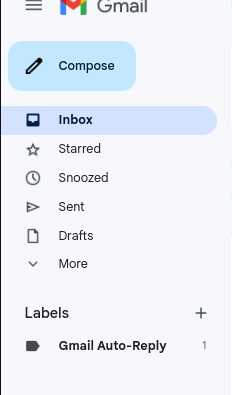
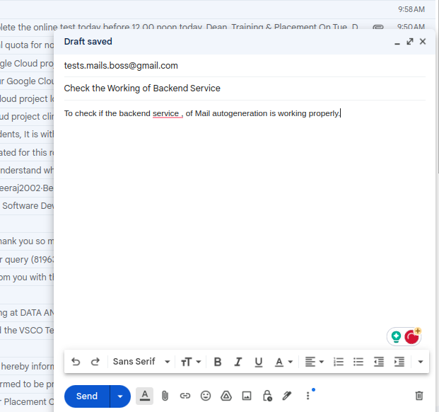
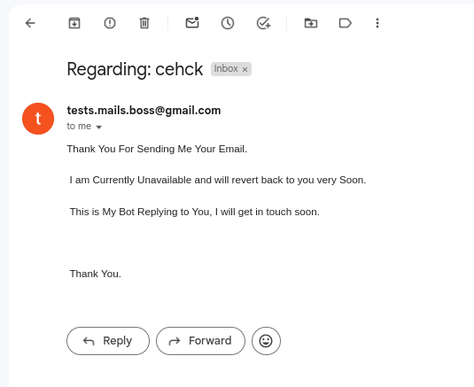
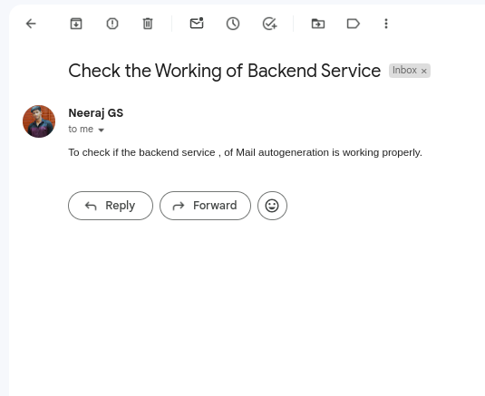

# Gmail Auto-Reply

A Backend Service that sends reply automatically for messages recieved and also adds a label for the email. This is an automatic process that performs the replying of unread messages in a specific time interval.


### Tech Stack

- JavaScript as the programming language
- Node.js as a Js Runtime
- Express.js for a backend server
- Google-cloud/local-auth for authenticatoin
- GoogleAPIs to access gmail and perform operations on it


### Features

- Automatic replies
- Searches for unread messages and replies in a time interval
- Does not require any Database
- Assigns Label to the emails, replies only for the 1st time senders.
- It checks for unread messge between 45 to 120 seconds interval.


### Screenshots












### Run Locally

Clone the project

```bash
  git clone https://github.com/neeraj-gs/Gmail-Auto-Reply.git
```

Go to the project directory

```bash
  cd server
```

Install dependencies

```bash
  npm install
```

Start the server

```bash
  node server.js
```

Application started Go to the URL and Login using Google
```bash
  http://localhost:8000
```

Open your Gmail and send a Message to the mail that you logged in from another mail
```bash
  You will see a Label already in the left Sidebar 
```

Wait for a time between 45-120 seconds , an automatic mail is sent to the sender.
```bash
  Sender can check the mail from the Bot sent from the user.
```
### Future Work and Improvements

- Use OpenAI to generate message based in the mail , instead of harcoding the Reply message.
- Deploy the server and make it run infinitely using pm2, so that users need not run the backend server everytime they have to reply.
- Create a frontend , giving information about the proejct and a login button.
- Can Convert the code from Javascript to Typescript for more type safer code.
- Can Deploy on AWS for Aitoscaling feature , if the number requests going to backend are high.

